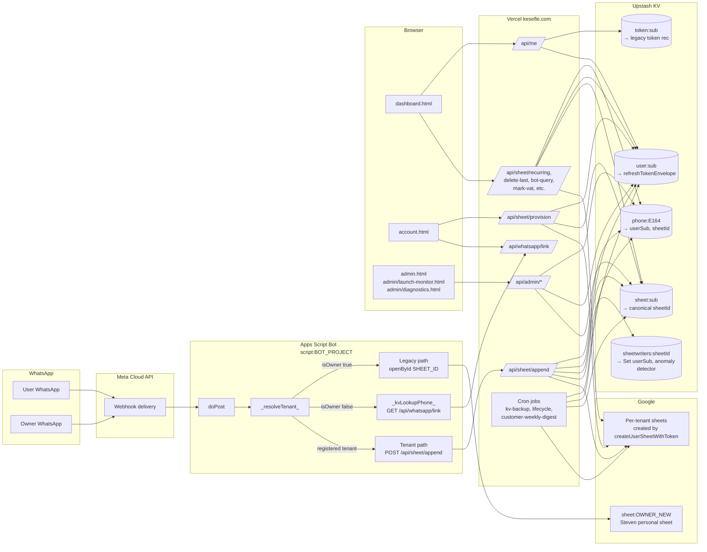

# System Sheet Reference Audit

Read-only audit. No code or configuration was changed. Branch: `audit-system-sheet-refs`. Date: 2026-05-28.

This document maps every spreadsheet reference across the Kesefle stack — bot, client dashboard, admin, account/website, API endpoints, Apps Script Properties, Vercel env, and open-sheet URL construction — and flags risks where a sheet ID is hardcoded or where the per-tenant resolution chain has a gap.

Secret values (sheet IDs, OAuth client ID, owner phone) are masked in tables as `<sheet:OWNER_OLD>`, `<sheet:OWNER_NEW>`, `<sheet:CASA_TEMPLATE>`, `<script:BOT_PROJECT>`, `<phone:OWNER>`, `<client:GOOGLE_OAUTH>`. The masking map at the bottom resolves them.

---

## 0. TL;DR

- The production live-write path for non-owner users (`/api/sheet/append` + every other `/api/sheet/*` endpoint) is correctly per-tenant: phone → `user:{sub}` → `sheet:{sub}` via Vercel KV, with a leak guard that aborts the write if the phone-cached sheet disagrees with the canonical one. No hardcoded tenant sheet IDs anywhere in `api/**`.
- The Apps Script bot still ships with one hardcoded sheet ID — `const SHEET_ID` — and 61 `SpreadsheetApp.openById(SHEET_ID)` call sites. This path is now guarded by `_assertOwnerLegacyWrite_` + `_isOwnerPhone_`, so a non-owner inbound webhook never reaches it. The risk has shifted from "cross-tenant leak" to "single-tenant coupling": when the owner's sheet moves again, every legacy code path (totals, weekly digest, recurring orders, BOT_COMMANDS, year selector wiring, dashboard repair) needs the constant flipped.
- There are 56 distinct hardcoded occurrences of one of 4 known IDs across the bot `bot/*.gs` files plus a handful of internal docs. None of them are reachable through the multi-tenant write path — they are all owner-only utility scripts or are gated by `OWNER_PHONE`.
- Stale env var: `KESEFLE_TEMPLATE_SHEET_ID` is probed at `api/health.js:47` but no live code reads it. New tenants get a fresh sheet from `createUserSheetWithToken` (`drive.file` scope), not a template copy. Suggest removing the probe to avoid false-positive ops alerts.
- Minor inconsistency: `/api/me` resolves the sheet from `token:{sub}` or `user:{sub}` only — it does NOT consult the canonical `sheet:{sub}` record. Every other endpoint prefers `sheet:{sub}` first. This will return a stale sheet URL to the dashboard for the brief window after reprovision but before backfill.

Total spreadsheet references mapped: **94** (across 11 system areas). Total risks flagged: **9** (1 high, 4 medium, 4 low).

---

## 1. Topology diagram



Plain-text fallback for screen readers:

```
WhatsApp (user + owner)
  --> Meta Cloud webhook
    --> bot/ExpenseBot_FIXED.gs:doPost
      --> _resolveTenant_(fromPhone)
        --> { isOwner: true } -> LEGACY: SpreadsheetApp.openById(SHEET_ID) -> sheet:OWNER_NEW
        --> { isOwner: false, registered } -> POST /api/sheet/append
        --> { isOwner: false, unknown } -> onboarding reply

POST /api/sheet/append (kesefle.com)
  -> KV: phone:{E164}  -> userSub
  -> KV: sheet:{userSub} -> canonical spreadsheetId  (preferred)
  -> KV: user:{userSub}  -> refreshTokenEnvelope
  -> leak guard: abort if phoneRec.sheetId disagrees with canonical
  -> Sheets API v4: spreadsheets/{spreadsheetId}/values/...:append
  -> anomaly detector: kv set sheetwriters:{spreadsheetId} -> Set<userSub>

Browser (dashboard.html / account.html)
  -> GET /api/me  (cookie) -> { user, sheet: { spreadsheetId, spreadsheetUrl } }
  -> POST /api/sheet/provision (access token, retry path uses cookie)
  -> POST /api/whatsapp/link (link / confirm)

Admin (admin/*.html)
  -> /api/admin/recent-signups, /api/admin/launch-monitor, /api/admin/inbox,
     /api/admin/reprovision-user-sheet, /api/admin/user-timeline,
     /api/admin/resend-welcome -> all resolve phone -> userSub -> sheet:{sub}
```

---

## 2. Area-by-area findings

### Area 1. Bot (Apps Script)

Files in scope: `bot/ExpenseBot_FIXED.gs` (canonical) and `bot/ExpenseBot_DEPLOY.gs` (paste-ready copy). Bot supplementary `.gs` files audited below in their own subsection.

| System area | File / API / property | Current reference | Should reference | Risk | Test needed |
| --- | --- | --- | --- | --- | --- |
| Bot legacy write | `bot/ExpenseBot_FIXED.gs:26` | `const SHEET_ID = '<sheet:OWNER_NEW>'` (Steven's personal sheet, NEW) | Same — bot is single-tenant on the owner path by design | LOW (single-tenant coupling only) | `bot/test_isolation.js` — confirms `_resolveTenant_` rejects non-owner phones before any legacy write |
| Bot legacy write | `bot/ExpenseBot_DEPLOY.gs:101` | mirror of `_FIXED` | Should remain in sync with `_FIXED` | LOW | Apps Script paste-test: confirm both files have identical `SHEET_ID` after every deploy |
| Owner phone fallback | `bot/ExpenseBot_FIXED.gs:36` | `const OWNER_PHONE = '<phone:OWNER>'` | Script Property `SHEET_OWNER_PHONE` (preferred); constant is fallback | LOW (fallback is correct, but if Steven's number ever changes both places must move) | `_isOwnerPhone_` unit test in `bot/test_isolation.js` |
| openById call count | `bot/ExpenseBot_FIXED.gs` | 61 `SpreadsheetApp.openById(SHEET_ID)` invocations | All inbound-write call sites must be preceded by `_assertOwnerLegacyWrite_(fromPhone, ctx)` returning true | MEDIUM (sweeping audit: any new openById added without the guard re-introduces the cross-tenant leak class) | Lint/grep in CI: `grep -c 'openById(SHEET_ID)'` must equal `grep -c '_assertOwnerLegacyWrite_'` callers, OR adopt a single `_legacyOwnerOpen_(ctx)` wrapper |
| Tenant resolution | `bot/ExpenseBot_FIXED.gs:5466` (`_resolveTenant_`) | Returns `{isOwner, userRecord}`; calls `/api/whatsapp/link?phone=` with `x-kesefle-bot-secret` | Correct | LOW | `bot/test_isolation.js` already covers; expand to assert empty `fromPhone` returns null, not `{isOwner:true}` |
| Tenant write bridge | `bot/ExpenseBot_FIXED.gs` (search for `/api/sheet/append`) + `lib/sheet-writer.js` | POST to `KESEFLE_API_BASE/api/sheet/append` with bot secret | Correct | LOW | Integration: send Hebrew expense from a registered non-owner number, confirm row lands in their sheet not owner's |
| Properties read | `PropertiesService.getScriptProperties()` | Reads: `KESEFLE_API_BASE`, `KESEFLE_BOT_SECRET`, `KESEFLE_CRON_SECRET`, `SHEET_OWNER_PHONE`, `WHATSAPP_TOKEN`, `WHATSAPP_PHONE_NUMBER_ID`, `ANTHROPIC_API_KEY`, `OPENAI_API_KEY`, `GEMINI_API_KEY`, `GEMINI_MODEL`, `KFL_CONFIDENCE_ASK_THRESHOLD`, `WEEKLY_SUMMARY_PHONE`, `DIGEST_PHONE`, `BLACKLIST_PHONES`, `ANOMALY_ALERTS_DISABLED`, `FX_RATE_*`; also `VERCEL_KV_REST_URL` + `VERCEL_KV_REST_TOKEN` declared in `bot/config.gs` | All reads are env-driven; no hardcoded secrets in `_FIXED.gs` itself | LOW | Manual check at deploy time per `docs/BOT_SECRET_ROTATION.md` |
| Receipt OCR | `bot/ExpenseBot_FIXED.gs:_handleReceiptImage_` | Same `SHEET_ID` path (owner-only); else routes through tenant write API | Correct | LOW | Photo-receipt happy-path test |
| Bot version stamp | `bot/ExpenseBot_FIXED.gs:62` | `KFL_BUILD_VERSION = '2026-05-28-pr-b-biz-canonical-subs'` | Bump per deploy per skill `bot-version-bump` | LOW | `/api/admin/bot-version` drift detector |
| WhatsApp number | `bot/ExpenseBot_FIXED.gs:53` | Default `WHATSAPP_PHONE_NUMBER_ID = '1086749664527399'` (Meta test number) | Script Property `WHATSAPP_PHONE_NUMBER_ID` (preferred); never the dead Numero ID `1090404180828069` | MEDIUM (wrong default + Script Property unset would send replies from a dead number — already documented inline; flag for ops checklist) | Send "test" command, confirm reply arrives in same WhatsApp thread |
| Phone Number ID also exposed | `bot/config.gs:27` | `BOT_PHONE_NUMBER_ID = '1090404180828069'` (the dead Numero) — appears to be a stale constant from before Meta test number was adopted | Either remove or update to `1086749664527399` and rename | LOW (no live read of this constant in `_FIXED.gs`) | Grep confirms `BOT_PHONE_NUMBER_ID` not referenced anywhere else |

#### Bot supplementary .gs files (paste-once utility scripts; not part of webhook path)

Every file below contains an internal constant pointing at one of the two Steven-owned sheets. None of them are reachable from `doPost` — they are designed to be invoked manually by Steven from the Apps Script editor to rebuild dashboards, repair formulas, run migrations, etc. Risk is "wrong-sheet damage to Steven only" — not cross-tenant.

| File | Constant name | Current value | Risk if Steven flips sheets again |
| --- | --- | --- | --- |
| `bot/config.gs:23` | `PERSONAL_TEMPLATE_SHEET_ID` | `<sheet:OWNER_OLD>` | MEDIUM — appears used as a documentation pointer only, but a future cron that consults this would silently target the wrong sheet |
| `bot/personal_sheet_fix.gs:42` | `_PSF_SHEET_ID_` | `<sheet:OWNER_NEW>` | LOW — Phase 1 migration synced this; rollback comment present |
| `bot/FIX_DASHBOARD_2023_2024_2025.gs:29` | `KESEFLE_SHEET_ID` | `<sheet:OWNER_OLD>` | MEDIUM — runs SUMIFS repair; if Steven runs it now it touches the OLD sheet |
| `bot/FIX_DASHBOARD_safe.gs:5` | `KESEFLE_SHEET_ID` | `<sheet:OWNER_OLD>` | MEDIUM — same |
| `bot/FIX_PROFITABILITY_AND_CHART.gs:14` | `KESEFLE_SHEET_ID_FP` | `<sheet:OWNER_OLD>` | MEDIUM |
| `bot/KESEFLE_ALL_PATCHES.gs:14` | `KESEFLE_SHEET_ID_ALL` | `<sheet:OWNER_OLD>` | MEDIUM |
| `bot/DASHBOARD_QUICK_WINS.gs:7` | `KESEFLE_SHEET_ID_QW` | `<sheet:OWNER_OLD>` | LOW (no destructive writes in this file) |
| `bot/CLEANUP_DUPLICATES_AND_TABS.gs:16` | `KFL_CL_SHEET_ID` | `<sheet:OWNER_OLD>` | HIGH if invoked — clears tabs by name |
| `bot/CLEANUP_LEAKED_ROWS.gs:39` | `CLR_SHEET_ID` | `<sheet:OWNER_OLD>` | HIGH if invoked — deletes rows |
| `bot/CREATE_TEMPLATE_AND_CLEANUP.gs:15` | `SOURCE_SHEET_ID_CT` | `<sheet:OWNER_OLD>` | LOW (one-shot, used to create the original `<sheet:CASA_TEMPLATE>`) |
| `bot/SCAN_OLD_CATEGORIES.gs:44` | `_SOC_OLD_SHEET_ID_` | `<sheet:OWNER_OLD>` | LOW (read-only scan) |
| `bot/SHEET_DASHBOARD_FULL_AUDIT.gs:49/50` | `_FA_NEW_SHEET_ID_` / `_FA_OLD_SHEET_ID_` | `<sheet:OWNER_NEW>` and `<sheet:OWNER_OLD>` | LOW (read-only audit) |
| `bot/SHEET_DASHBOARD_SMART_REMAP.gs:62` | `_SR_SHEET_ID_` | `<sheet:OWNER_NEW>` | MEDIUM — rewrites dashboard formulas |
| `bot/SHEET_YEAR_SELECTOR_WIRE.gs:60` | `_YS_SHEET_ID_` | `<sheet:OWNER_NEW>` | MEDIUM — wires year selector |
| `bot/EMBED_FINANCIAL_SUMMARY_IN_DASHBOARD.gs:18` | `KFL_SHEET_ID_EM` | `<sheet:OWNER_OLD>` | MEDIUM |
| `bot/FINANCIAL_SUMMARY_TAB_CLEAN.gs:8` | `KFL_SHEET_ID` | `<sheet:OWNER_OLD>` | MEDIUM |
| `bot/SORT_AND_FEATURES.gs:7` | `KESEFLE_SHEET_ID_SF` | `<sheet:OWNER_OLD>` | LOW |
| `bot/WEEKLY_DIGEST.gs:32` | `WD_SHEET_ID` | `<sheet:OWNER_OLD>` | MEDIUM — owner's weekly digest reads this, so it now reads stale data |
| `bot/BOT_COMMANDS.gs:22` | `BC_SHEET_ID` | `<sheet:OWNER_OLD>` | MEDIUM — commands surface |
| `bot/MIGRATE_OLD_TO_KESEFLE.gs:29/30` | `_MIG_OLD_SHEET_ID_` / `_MIG_NEW_SHEET_ID_` | OLD + NEW | LOW (migration script, both IDs needed) |
| `bot/MIGRATE_OLD_NOTES.gs:52/53` | `_MN_OLD_SHEET_ID_` / `_MN_NEW_SHEET_ID_` | OLD + NEW | LOW |
| `bot/MIGRATE_PHASE_5_VERIFY_FORMULAS.gs:46` | `_MP5_NEW_SHEET_ID_` | NEW | LOW |
| `bot/MIGRATE_PHASE_7_SWEEP_OLD_REFS.gs:48/49` | `_MP7_OLD_SHEET_ID_` / `_MP7_NEW_SHEET_ID_` | OLD + NEW | LOW |

Suggested action: collapse all 24 supplementary constants into a single `bot/_sheet_ids.gs` that exports `OWNER_OLD_SHEET_ID`, `OWNER_NEW_SHEET_ID`, and `CASA_TEMPLATE_SHEET_ID`, with one update site per ID flip. Apps Script auto-merges `.gs` files in the same project so this is a no-op refactor.

### Area 2. Client dashboard

| System area | File / API / property | Current reference | Should reference | Risk | Test needed |
| --- | --- | --- | --- | --- | --- |
| Dashboard sheet link | `dashboard.html:1907,1909,1910,1911,2049` | `s.spreadsheetUrl` from `localStorage.kesefle_sheet` (populated by `/api/me`) | Correct — no hardcoded ID | LOW | Manual: clear localStorage, reload dashboard, confirm link still resolves |
| Dashboard data fetch | `dashboard.html` calls (search for `/api/sheet/`) | Always per-cookie, no sheet ID in any URL | Correct | LOW | curl with no cookie -> 401; with cookie -> own data only |
| Hydration | `dashboard.html:1882` | Falls back to `/api/me` if localStorage is empty | Correct | LOW | Tested by `api/me.js` |
| OAuth client | `dashboard.html:1749` | `var GOOGLE_CLIENT_ID = '<client:GOOGLE_OAUTH>'` | Could be loaded from `/api/config` to avoid hardcoding the OAuth client in HTML, but the client ID is public per OAuth spec; LOW risk | LOW | n/a |

No hardcoded sheet IDs in `dashboard.html`. No `dashboard-*.js` files exist (all client JS is inline in `dashboard.html`).

### Area 3. Admin dashboard

| System area | File / API / property | Current reference | Should reference | Risk | Test needed |
| --- | --- | --- | --- | --- | --- |
| Admin top dash | `admin.html` | Calls `/api/admin/launch-monitor`, `/api/admin/inbox`, etc.; renders `u.sheetUrl` from API response | Correct — no hardcoded ID | LOW | Manual: open admin, click "Open" on a row, confirm correct sheet |
| Launch monitor | `admin/launch-monitor.html:846,847,1284,1287` | `u.sheetUrl` and `j.spreadsheetUrl` from server responses | Correct | LOW | Same as above |
| Diagnostics | `admin/diagnostics.html` | Calls admin APIs only; no sheet ID construction client-side | Correct | LOW | n/a |
| Monitor | `admin/monitor.html` | Read-only health/KV monitor; no sheet construction | Correct | LOW | n/a |
| Admin endpoints | `api/admin/recent-signups.js:77`, `reprovision-user-sheet.js`, `resend-welcome.js`, `user-timeline.js`, `create-sample-sheet.js`, `inbox.js`, `launch-monitor.js`, `stats.js`, `customer-digest-set.js`, `bot-version.js`, `config-drift.js`, `funnel-summary.js`, `help-queries.js`, `referral-leaderboard.js`, `revenue.js`, `sheets-quota.js`, `user-reports.js` | All resolve sheets via `phone:{E164}` → `userSub` → `sheet:{sub}` OR direct scan of `user:*` / `sheet:*` keys | Correct | LOW | `api-tenant-isolated` skill covers |

No hardcoded sheet IDs in admin code or HTML.

### Area 4. Account / website

| System area | File / API / property | Current reference | Should reference | Risk | Test needed |
| --- | --- | --- | --- | --- | --- |
| Account page | `account.html:1327,1340,1366,1431,1516,1564,1597,1602,1604,1608,1756,1937` | All `s.spreadsheetUrl` / `j.spreadsheetUrl` from `/api/me` and `/api/sheet/provision` responses | Correct — no hardcoded ID | LOW | Manual: complete OAuth, confirm provision result writes localStorage with correct URL |
| Welcome | `welcome.html` | No sheet refs | n/a | LOW | n/a |
| OAuth client | `account.html:39` | `<client:GOOGLE_OAUTH>` | Public by spec | LOW | n/a |
| OAuth client | `index.html:262` | `<client:GOOGLE_OAUTH>` | Public by spec | LOW | n/a |
| Index "open my sheet" CTA | `index.html` | Uses `/account` redirect; no direct sheet link | Correct | LOW | n/a |

### Area 5. API endpoints

All `/api/sheet/*` endpoints share the same tenant-resolution pattern with minor variations:

| Endpoint | File | Resolution path | Leak guard? | Risk |
| --- | --- | --- | --- | --- |
| `/api/sheet/append` | `api/sheet/append.js:103-156` | phoneRec → sheet:{sub} (canonical) → user:{sub} (token). Aborts on `sheet_ownership_mismatch`. Self-heals phone-cache. | Yes — `canonicalSheetId !== phoneSheetId` → 409 | LOW |
| `/api/sheet/bot-query` | `api/sheet/bot-query.js:165-205` | Same | Same | LOW |
| `/api/sheet/recurring` | (handled inside `api/recurring.js:175-193`) | Same | Same | LOW |
| `/api/sheet/delete-last` | `api/sheet/delete-last.js:71-105` | Resolves via `phoneRec.userSub`; reads `sheet:{sub}` for canonical | Yes (lines 77-82) | LOW |
| `/api/sheet/delete-rows` | `api/sheet/delete-rows.js:76-79` | session userSub → sheet:{sub} | n/a (single-user write) | LOW |
| `/api/sheet/mark-vat` | `api/sheet/mark-vat.js:95-114` | phoneRec → sheet:{sub} | Yes | LOW |
| `/api/sheet/add-category-row` | `api/sheet/add-category-row.js:204-232` | phoneRec → sheet:{sub} | Yes | LOW |
| `/api/sheet/csv-import` | `api/sheet/csv-import.js:297-317` | phoneRec → sheet:{sub} | Yes | LOW |
| `/api/sheet/export` | `api/sheet/export.js:54-57` | session userSub → sheet:{sub} | n/a | LOW |
| `/api/sheet/stats` | `api/sheet/stats.js:79-` | phoneRec → sheet:{sub} | Yes | LOW |
| `/api/sheet/summary` | `api/sheet/summary.js` | session userSub → sheet | n/a | LOW |
| `/api/sheet/getExpenses` | `api/sheet/getExpenses.js` | session userSub → sheet | n/a | LOW |
| `/api/sheet/tax-report` | `api/sheet/tax-report.js` | session userSub → sheet | n/a | LOW |
| `/api/sheet/relabel-row` | `api/sheet/relabel-row.js` | phoneRec → sheet:{sub} | Yes | LOW |
| `/api/sheet/fix-company-dashboard` | `api/sheet/fix-company-dashboard.js` | session userSub → sheet | n/a | LOW |
| `/api/sheet/monthly-statement` | `api/sheet/monthly-statement.js` | session userSub → sheet | n/a | LOW |
| `/api/sheet/web-append` | `api/sheet/web-append.js` | session userSub → sheet | n/a | LOW |
| `/api/sheet/provision` | `api/sheet/provision.js` | Creates fresh sheet via Drive API with verified access token; writes `sheet:{sub}` + updates `user:{sub}` | n/a (mint-only) | LOW |
| `/api/sheet/bot-query` (admin-side) | (see above) | Same | Same | LOW |

| Other API endpoints that touch sheets | File | Notes |
| --- | --- | --- |
| `/api/me` | `api/me.js:68-70` | **Inconsistency**: pulls sheet from `token.sheetId` or `userRec.spreadsheetId`. Does NOT consult `sheet:{sub}` first like the sheet endpoints do. After a `/api/admin/reprovision-user-sheet` call, `/api/me` may return the stale ID until `user:{sub}` is touched. Risk: MEDIUM (visible-only — dashboard renders a stale "open sheet" link); fix: read `sheet:{sub}` first like every other endpoint |
| `/api/account` | `api/account.js` | KV-backed; no sheet writes |
| `/api/whatsapp/link` | `api/whatsapp/link.js:36` | Builds `spreadsheetUrl` from `sheetRec.spreadsheetId` (canonical) — correct |
| `/api/whatsapp/webhook` | `api/whatsapp/webhook.js` | Webhook receiver only (bot does the work via Meta -> Apps Script) — no sheet writes |
| `/api/group` | `api/group.js:99` | Reads `GROUP_SHEET_TEMPLATE_ID` env var. If unset, group lives in KV only (per inline comment). No live evidence the var is set in production. Risk: LOW (degraded mode is functional) |
| `/api/import/bank-csv` | `api/import/bank-csv.js` | Calls `/api/sheet/csv-import` internally |

### Area 6. Apps Script Properties

Required for the bot to run correctly. None of these are sheet IDs themselves — they configure the per-tenant routing.

| Property | Required | Effect when unset |
| --- | --- | --- |
| `KESEFLE_API_BASE` | Optional (defaults `https://kesefle.com`) | Bot would call wrong host; obvious break |
| `KESEFLE_BOT_SECRET` | YES | `/api/sheet/append` returns 401, every non-owner write fails silently |
| `KESEFLE_CRON_SECRET` | YES for `cronGroupRecurring` and friends | Cron tasks abort |
| `SHEET_OWNER_PHONE` | YES (per docs) | Falls back to hardcoded `OWNER_PHONE`; if owner phone is wrong, bot now correctly returns false from `_isOwnerPhone_` for non-owners (no longer the leak class) but the owner himself would be unable to write via the legacy path until set |
| `WHATSAPP_TOKEN` | YES | Bot cannot reply |
| `WHATSAPP_PHONE_NUMBER_ID` | YES | Bot replies from default test number, which is correct only for the Meta sandbox |
| `ANTHROPIC_API_KEY` / `GEMINI_API_KEY` / `OPENAI_API_KEY` | Optional | LLM features degrade gracefully |
| `KFL_CONFIDENCE_ASK_THRESHOLD` | Optional | Defaults 0.85 |
| `WEEKLY_SUMMARY_PHONE` / `DIGEST_PHONE` | Optional | Owner-only digest features off |
| `BLACKLIST_PHONES` | Optional | No phones are blocked |
| `ANOMALY_ALERTS_DISABLED` | Optional | Alerts on |
| `FX_RATE_*` | Optional | Hardcoded fallbacks |
| `VERCEL_KV_REST_URL` + `VERCEL_KV_REST_TOKEN` | Optional | Declared in `bot/config.gs` but I did not find any active read; legacy from before the bot routed KV reads through the Vercel API |

Auxiliary `.gs` files use other property names (`WA_TOKEN`, `WA_PHONE_ID`, `WA_GRAPH_VERSION`, `SUBSCRIBERS`, `optout:*`) for one-off command surfaces — separate from the main bot.

### Area 7. Vercel env vars

Distinct env vars referenced across `api/` + `lib/` (65). Sheet/tenant-routing relevant ones:

| Env var | Required | Notes |
| --- | --- | --- |
| `KV_REST_API_URL` / `KV_REST_API_TOKEN` | YES | Upstash KV credentials. Without them every `kvGet` returns null and tenant writes 404 |
| `KESEFLE_BOT_SECRET` | YES | Shared secret between bot and Vercel. `/api/sheet/append` fails closed if missing |
| `KESEFLE_CRON_SECRET` | YES for crons | Vercel cron auth |
| `GOOGLE_CLIENT_ID` / `GOOGLE_CLIENT_SECRET` | YES | OAuth |
| `KESEFLE_DB_KEY` / `KESEFLE_DB_KEY_ACTIVE_KID` | YES | Envelope decryption for refresh tokens stored in `user:{sub}` |
| `KESEFLE_OWNER_PHONE` | Optional (defaults `<phone:OWNER>`) | Used in `lib/billing.js:103` + `lib/error-alert.js:31` for owner-only alerts |
| `KESEFLE_TEMPLATE_SHEET_ID` | **DEAD** | Probed at `api/health.js:47` only. No live read. Suggest removing the probe to clean up ops noise — sheets are now created fresh, not cloned |
| `GROUP_SHEET_TEMPLATE_ID` | Optional | Used in `api/group.js:99`. If unset, group sheets are not created (KV-only group). |
| `ADMIN_BACKUP_USER_SUB` | YES for `api/cron/kv-backup.js` | Points the daily KV backup at Steven's userSub; backup lands in his Drive |
| `ADMIN_PUSH_USER_SUBS` | Optional | Comma-separated list of admin subs to push alerts to (`lib/alert.js:83`) |
| `META_ACCESS_TOKEN` / `WHATSAPP_TOKEN` (alias) | YES | Outbound WhatsApp |
| `META_PHONE_NUMBER_ID` / `WHATSAPP_PHONE_NUMBER_ID` | YES | Bot reply number |
| `META_VERIFY_TOKEN` / `META_APP_SECRET` | YES | Webhook verification |
| `WABA_APPROVED` | Optional | UX-only gate; not in sheet path |

### Area 8. Open-sheet URL construction

Every place that constructs `https://docs.google.com/spreadsheets/d/...` (excluding docs/examples and the bot's owner-only legacy):

| Location | Pattern | ID source | Risk |
| --- | --- | --- | --- |
| `lib/sheet-writer.js:896` | `res.j.spreadsheetUrl || 'https://docs.google.com/spreadsheets/d/${spreadsheetId}'` | Returned from Drive API for the sheet just created | LOW |
| `lib/sheet-writer.js:967` | `'https://docs.google.com/spreadsheets/d/${j.id}'` | Sheet just created | LOW |
| `lib/secure-kv.js:400` | `spreadsheetUrl || 'https://docs.google.com/spreadsheets/d/${spreadsheetId}'` | KV record being written | LOW |
| `api/whatsapp/link.js:36` | per-`sheetRec.spreadsheetId` | KV canonical | LOW |
| `api/me.js:70` | per-`sheetId` (from `token:{sub}` or `user:{sub}`) | See Area 5 inconsistency note | MEDIUM — stale-id risk |
| `api/admin/resend-welcome.js:80` | per-`sheetRec.spreadsheetId` | KV canonical | LOW |
| `api/admin/recent-signups.js:81` | per-`sheetRec.spreadsheetId` | KV canonical | LOW |
| `api/sheet/add-category-row.js:274,321` | per-`spreadsheetId` resolved at top of handler | Canonical | LOW |
| `api/sheet/provision.js:155` | per-`parsed.spreadsheetId` of just-created sheet | LOW |
| `api/sheet/csv-import.js:400` | per-`spreadsheetId` resolved at top | LOW |
| `bot/ExpenseBot_FIXED.gs:1244, 1251, 10670, 11299, 11371, 11588, 11600` | `'https://docs.google.com/spreadsheets/d/' + SHEET_ID + '/edit'` | The hardcoded `SHEET_ID` — owner-only reply text. `_resolveTenant_` gates these surfaces | LOW (owner-only) |
| `bot/ExpenseBot_FIXED.gs:1251` (else branch) | `rec.sheetId` | Tenant write reply uses the response from `/api/sheet/append`, which carries `spreadsheetUrl`. Correct. | LOW |
| `bot/ExpenseBot_FIXED.gs:3158` | `r.group.sheetUrl || (... r.group.sheetId)` | Tenant group response | LOW |
| `dashboard.html`, `account.html`, `admin/*.html` | All `*.href = j.spreadsheetUrl` (server-supplied) | LOW |

### Area 9. Review Inbox

Confirmed: no Apps Script "Review Inbox" tab exists. The admin-facing customer-signals inbox is `/api/admin/inbox` (KV-backed, see `api/admin/inbox.js`), surfaced in `admin.html`. No sheet refs.

### Area 10. Bot Messages tab

Confirmed: no "Bot Messages" tab in any tenant sheet (searched `bot/`, `lib/sheet-writer.js`, `api/sheet/*`). Bot replies are not logged to the user's sheet — they live in WhatsApp + structured logs (`/api/log`).

### Area 11. Monday refs in code

Searched for `monday.com`, `monday-feature-spec`, hardcoded board IDs. Found:

- Monday is referenced only in `.claude/skills/monday-*` skill docs and `docs/monday-sync-at-turn-end` patterns.
- No code in `api/`, `lib/`, `bot/`, or public HTML imports Monday SDK or uses Monday GraphQL.
- No sheet IDs are stored in Monday tasks (sheet IDs live in KV).

Risk: LOW. Action: none.

---

## 3. Hardcoded sheet ID census

Total hardcoded occurrences of the 4 known Drive IDs across the live codebase (excluding `.bak.*`, `.claude/worktrees`, and `kesefle_export_*`): **56 lines** across **27 files**.

Breakdown by ID:

| ID | Occurrences | Files |
| --- | --- | --- |
| `<sheet:OWNER_OLD>` | 27 lines across 20 `.gs` files + 6 `.md` files + 1 `.gs` config | Mostly owner-only repair / dashboard / weekly digest scripts that pre-date the OLD → NEW migration |
| `<sheet:OWNER_NEW>` | 8 lines across `_FIXED.gs`, `_DEPLOY.gs`, `personal_sheet_fix.gs`, `SHEET_YEAR_SELECTOR_WIRE.gs`, `SHEET_DASHBOARD_SMART_REMAP.gs`, `SHEET_DASHBOARD_FULL_AUDIT.gs`, `MIGRATE_*.gs` | Migration target |
| `<sheet:CASA_TEMPLATE>` | 1 line in `docs/oauth-verification/scope-justifications.md` | Documentation only |
| `<script:BOT_PROJECT>` | 5 lines across `YOUR_TASKS.md`, `LAUNCH_TODAY.md`, `README.md`, `bot/README.md`, `bot/DROPDOWN_README.md`, `bot/WEEKLY_DIGEST_README.md`, `bot/WHEN_YOU_ARE_BACK.md` | Apps Script project URL — not a sheet, but counted as a "Drive-shaped" ID |

Per the constraint "every hardcoded sheet ID is listed with file:line", see the supplementary-`.gs` table in Area 1. The complete list reproducibly extracted by:

```
cd /Users/stevenrancohen/Documents/Claude/Projects/kesefle
grep -rEn "1UKrXDkdiBwGzrvehacNfWOEvCukNTOAYoyXOIyKW-Qo|\
1rtiPQs1sABkDr_viCiDDg7LuQNGY0bxzPvKT-KEqP0A|\
1YRPf_X9cCVLxT1xWYQ9xwArsOyarMnw2P_FaBUIYwAE|\
1znNProbptLBkwqPmV-xWp6EirX7n_mJZvoJHf9si9Tw98y5-kvUgrHTo" \
  --include="*.js" --include="*.gs" --include="*.html" --include="*.md" --include="*.json" \
  --exclude-dir=node_modules --exclude-dir=.git --exclude-dir=.claude \
  --exclude-dir=kesefle_export_2026-05-25 --exclude="*.bak.*"
```

---

## 4. Risk register

| # | Severity | Title | Where | Recommendation |
| --- | --- | --- | --- | --- |
| 1 | HIGH | Destructive cleanup scripts still point at OLD sheet | `bot/CLEANUP_DUPLICATES_AND_TABS.gs:16`, `bot/CLEANUP_LEAKED_ROWS.gs:39` | Either update to NEW sheet or add a top-of-file `Logger.log('Running against <sheet:OWNER_OLD>; bail if not intended')` + explicit `if (Browser.msgBox(...) !== 'yes') return;` guard before any destructive `deleteRow` |
| 2 | MEDIUM | `/api/me` resolves sheet without consulting canonical `sheet:{sub}` | `api/me.js:68` | Read `kvGet('sheet:' + userId)` first, fall back to `token.sheetId` / `userRec.spreadsheetId`, matches every other endpoint |
| 3 | MEDIUM | Bot legacy openById has 61 call sites; no compile-time guarantee each is guarded | `bot/ExpenseBot_FIXED.gs` | Wrap in `_legacyOwnerOpen_(fromPhone, ctx)` that asserts owner internally; replace all 61 sites |
| 4 | MEDIUM | Stale `BOT_PHONE_NUMBER_ID = '1090404180828069'` in `bot/config.gs:27` | Remove or rename and align with actual live number `1086749664527399` |
| 5 | MEDIUM | Multiple dashboard-repair / weekly-digest scripts still point at OLD sheet | See Area 1 supplementary table | One-time sweep matching `MIGRATE_PHASE_7_SWEEP_OLD_REFS.gs` outcome — flip all OLD constants in scripts Steven currently uses |
| 6 | LOW | `KESEFLE_TEMPLATE_SHEET_ID` probed but unused | `api/health.js:47` | Remove from health probe; remove from `.env.example` template; remove from `docs.html:851,878` doc text |
| 7 | LOW | Owner phone default hardcoded in `lib/error-alert.js:31` + `lib/billing.js:103` | If owner ever changes, both must move | Single helper `getOwnerPhone()` in `lib/` |
| 8 | LOW | Constant `KESEFLE_BOT_NAME` / `KESEFLE_BOT_NUMBER` env vars are listed in `docs/AUDIT_ARCHITECTURE.md:323` but I did not find live reads in code | Documentation drift | Confirm/remove from architecture doc |
| 9 | LOW | `GROUP_SHEET_TEMPLATE_ID` undocumented in `.env.example` | `.env.example` is missing the group template var; `api/group.js:99` reads it | Add to `.env.example` with note "optional — group lives in KV if unset" |

---

## 5. Masking key (do not commit alongside this doc to public)

The four real IDs are not secrets per Google's sharing model (a Drive ID is only a capability via OAuth, not a credential). They are masked here to keep the audit doc neutral and to make future find-and-replace trivial:

| Mask | Real value | First file:line of reference (extraction reproducible via the grep block above) |
| --- | --- | --- |
| `<sheet:OWNER_OLD>` | `1UKrXDkdiBwGzrvehacNfWOEvCukNTOAYoyXOIyKW-Qo` | `bot/config.gs:23` |
| `<sheet:OWNER_NEW>` | `1rtiPQs1sABkDr_viCiDDg7LuQNGY0bxzPvKT-KEqP0A` | `bot/ExpenseBot_FIXED.gs:26` |
| `<sheet:CASA_TEMPLATE>` | `1YRPf_X9cCVLxT1xWYQ9xwArsOyarMnw2P_FaBUIYwAE` | `docs/oauth-verification/scope-justifications.md:27` |
| `<script:BOT_PROJECT>` | `1znNProbptLBkwqPmV-xWp6EirX7n_mJZvoJHf9si9Tw98y5-kvUgrHTo` | `bot/README.md:3` (Apps Script project URL, not a sheet) |
| `<phone:OWNER>` | `972547760643` | `bot/ExpenseBot_FIXED.gs:36`, `lib/error-alert.js:31`, `lib/billing.js:103` |
| `<client:GOOGLE_OAUTH>` | `191938738571-tlpptgagkbs82tc1omrrk8i6l0c02cm4.apps.googleusercontent.com` | `account.html:39`, `index.html:262`, `dashboard.html:1749` (public per OAuth spec) |

---

## 6. What was checked but is NOT a finding

- All `/api/sheet/*` endpoints correctly resolve per-tenant. No hardcoded tenant sheet IDs anywhere under `api/`.
- All public HTML pages (`dashboard.html`, `account.html`, `admin.html`, `admin/*.html`, `index.html`) construct sheet URLs only from server responses. No hardcoded sheet IDs in any HTML file.
- All cron jobs (`api/cron/*.js`) resolve sheets via KV scan + `sheet:{sub}` lookup. `kv-backup` uses `ADMIN_BACKUP_USER_SUB` env var to find Steven's userSub, then resolves his sheet via his own KV records.
- The CSP in `vercel.json:58` correctly allows `https://sheets.googleapis.com` only — no broader Google API allowlist than required.
- Service worker `sw.js` does not cache any sheet URLs or sheet IDs.
- No `monday.com`/Monday board IDs are stored in code (only in skill documentation).

End of audit.
